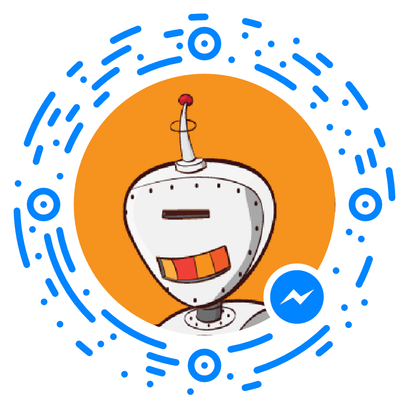

# WilBot

[](https://travis-ci.org/wmora/wilbot)

WilBot is my personal bot for Facebook Messenger. It can be used as a starting point for your own personal bots 🤖🤖

Talk to WilBot! Use the messenger code below or follow [this link](https://m.me/williammorabot)



All robot images were lovingly created by [robohash.org]('http://robohash.org')

## Project Setup
There are two env variables that should be set before starting the process: PAGE_ACCESS_TOKEN and VERIFY_TOKEN. You get both values from Facebook's developers console. If you don't set them, your calls to Facebook's API will fail. To run the project for the first time, do:
```
$ npm install
$ npm start
```
## Bot Setup
Follow the official [documentation](https://developers.facebook.com/docs/messenger-platform/complete-guide) for setting up your bot. This project also includes two scripts that are part of the setup:

* `create_greeting.sh`: Sets the greeting text that users see when they first discover your bot. To run it, you must pass your page access token as an argument. Ex:
```
$ ./create_greeting.sh my_page_access_token
```
* `create_get_started.sh`: Sets the 'Get Started' button that users see the first time they interact with your bot. You must also pass your page access token as an argument. Ex:
```
$ ./create_get_started.sh my_page_access_token
```
Note that the payload `'get_started'` is defined by me and part of the payloads supported in the project

## Project overview
The project is an express app (see [`bot.js`](bot.js)) that supports the `GET` and `POST` methods for the `'/webhook'` path. Anytime we receive an event from Facebook, it sends a [`sender_action`](https://developers.facebook.com/docs/messenger-platform/send-api-reference/sender-actions) to mark the message as read and then it will determine if it is a [`message`](https://developers.facebook.com/docs/messenger-platform/webhook-reference/message-received) or a [`postback`](https://developers.facebook.com/docs/messenger-platform/webhook-reference/postback-received) and handle it accordingly.

The [`brain`](brain) folder has all the payloads supported by the bot as well as the sequence of messages that should be sent for each payload.

You can follow the code if you want more detail.

## Feedback
I would love to have your feedback! Ask WilBot for my contact info and let me know 🤖🤖

## License
    Copyright 2016 William Mora

    Licensed under the Apache License, Version 2.0 (the "License");
    you may not use this file except in compliance with the License.
    You may obtain a copy of the License at

    http://www.apache.org/licenses/LICENSE-2.0

    Unless required by applicable law or agreed to in writing, software
    distributed under the License is distributed on an "AS IS" BASIS,
    WITHOUT WARRANTIES OR CONDITIONS OF ANY KIND, either express or implied.
    See the License for the specific language governing permissions and
    limitations under the License.
